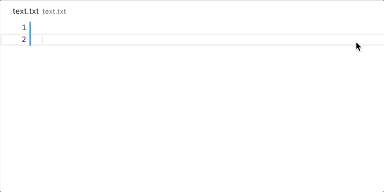

# Completion Item Provider Sample

This sample shows how to provide completions aka IntelliSense into the editor. The sample uses the `CompletionItemProvider` api.

## VS Code API

### `vscode` module

- [`languages.registerCompletionItemProvider`](https://code.visualstudio.com/api/references/vscode-api#languages.registerCompletionItemProvider)

## Running This MoonBit Port

- Open this folder (`test/samples/completions-sample`) in VS Code
- `moon check --target js`
- `moon build --target js --release`
- Run the `Run Extension` target in the Debug View (or press `F5`)
