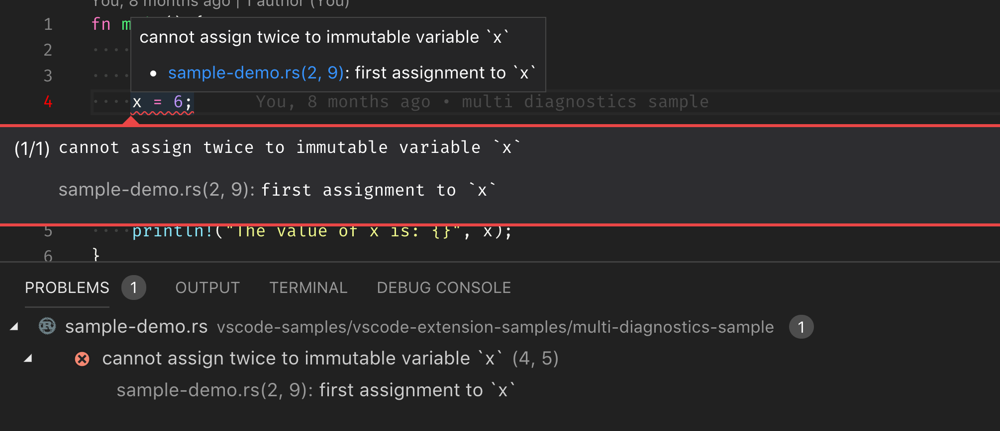

# README

This sample generates diagnostics with related information which can be seen in Problems view and in the editor.

## Set up & Test

- Clone this extension
- `npm install`
- Launch the extension
- Open the file [sample-demo.rs](sample-demo.rs) that exists in this extension
- `Problems view` shows an error with related information
- Typing `F8` in the editor also shows the error with related information

## Running This MoonBit Port

- Open this folder (`test/samples/diagnostic-related-information-sample`) in VS Code
- `moon check --target js`
- `moon build --target js --release`
- Run the `Run Extension` target in the Debug View (or press `F5`)
