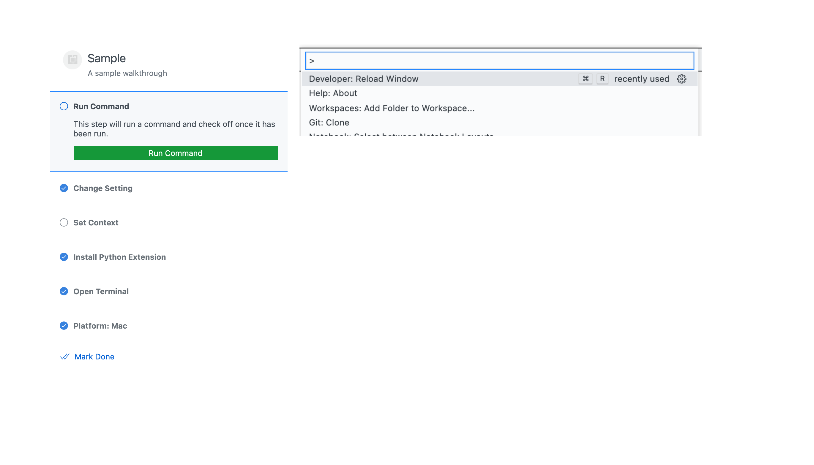

# getting-started-sample

This sample shows how to provide a walkthrough to the Getting Started section in vscode's welcome page.

## Running This MoonBit Port

- Open this folder (`test/samples/getting-started-sample`) in VS Code
- `moon check --target js`
- `moon build --target js --release`
- Run the `Run Extension` target in the Debug View (or press `F5`)
